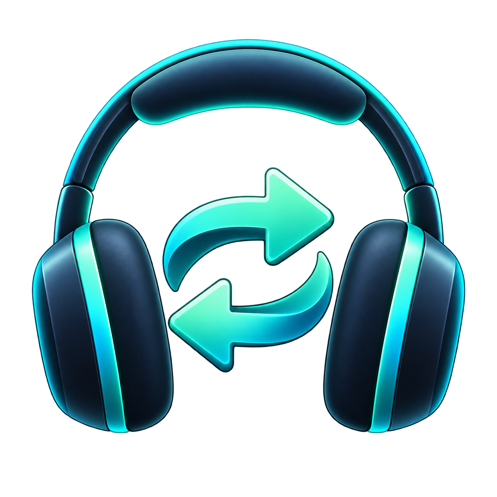

<p align="center">
  
</p>

<h1 align="center">AudioSwitcher</h1>

<p align="center">
  A Windows utility for audio profiles, global shortcuts, and quick device switching.
</p>

<p align="center">
  <a href="https://github.com/Diddlik/AudioSwitcher/releases/latest"></a>
  <a href="https://github.com/Diddlik/AudioSwitcher/actions/workflows/release.yml"></a>
  
  
</p>

<p align="center">
  <a href="https://github.com/Diddlik/AudioSwitcher/releases/latest"><strong>Download the latest installer</strong></a>
</p>

## Why AudioSwitcher?

Windows can switch default audio devices, but repeatedly selecting the same speaker, headset, and microphone combinations takes time. AudioSwitcher saves each combination as a profile and activates it with a click or global shortcut.

## Features

| Feature | Description |
| --- | --- |
| Audio profiles | One default output and input device per profile |
| Global shortcuts | Activate profiles from any application |
| Quick switch | Switch between two profiles with one shortcut |
| Direct key capture | Focus a shortcut field and press the required combination |
| All Windows roles | Set the Console, Multimedia, and Communications defaults together |
| System tray | Hide the window and keep AudioSwitcher running in the background |
| Startup | Start automatically for the current Windows user |
| Automatic updates | Download stable releases in the background |
| Languages | English, Russian, Ukrainian, French, Italian, and Polish |

## Installation

1. Download the [latest Windows installer](https://github.com/Diddlik/AudioSwitcher/releases/latest).
2. Run `Diddlik.AudioSwitcher-win-Setup.exe`.
3. Open AudioSwitcher and configure the first profile.

The installer does not require administrator rights. It is not code signed, so Windows may show a SmartScreen warning on first launch.

## Usage

1. Create and name a profile.
2. Select the output and input devices.
3. Click the shortcut field and press an optional key combination.
4. Select two profiles and capture a shortcut if you want to use quick switching.
5. Select **Save**.

Select **Activate now** to switch to the selected profile. Press `Delete` or `Backspace` to clear a shortcut. AudioSwitcher rejects combinations that another application has already registered.

## Settings

Open **Settings** to choose the interface language or enable automatic startup with Windows.

Closing the main window hides it. Use the tray menu to open AudioSwitcher again or exit it completely.

## Updates and local data

AudioSwitcher checks the public GitHub Releases feed for stable updates. It downloads an available update in the background and installs it when the application exits.

AudioSwitcher stores profiles and settings only in `%LocalAppData%\AudioSwitcher\config.json`.

## Development

Development requires Windows 10 or 11 and the .NET 10 SDK.

```powershell
dotnet build
dotnet test
dotnet run --project src/AudioSwitcher
```

Create a local Velopack installer with:

```powershell
.\scripts\package.ps1 -Version 1.3.0
```

The packages are written to `artifacts\releases`.

## Publishing

Push a tag in the `vMAJOR.MINOR.PATCH` format to start the release workflow. The workflow tests and publishes a standalone Windows x64 application, builds the Velopack packages, and uploads the installer and update feed to a GitHub release.
