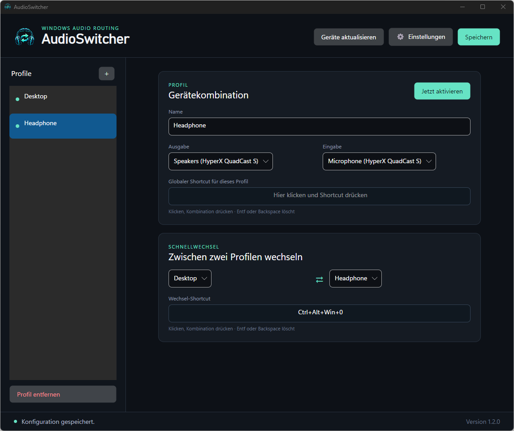
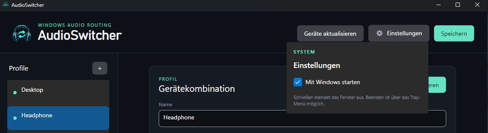

<p align="center">
  
</p>

<h1 align="center">AudioSwitcher</h1>

<p align="center">
  Ein schlankes Windows-Tool für Audio-Profile, globale Shortcuts und schnellen Gerätewechsel.
</p>

<p align="center">
  <a href="https://github.com/Diddlik/AudioSwitcher/releases/latest"></a>
  <a href="https://github.com/Diddlik/AudioSwitcher/actions/workflows/release.yml"></a>
  
  
</p>

<p align="center">
  <a href="https://github.com/Diddlik/AudioSwitcher/releases/latest"><strong>Aktuellen Installer herunterladen</strong></a>
</p>



## Warum AudioSwitcher?

Windows kann Standardgeräte umschalten, aber wiederkehrende Kombinationen aus Lautsprechern, Kopfhörern und Mikrofonen sind umständlich. AudioSwitcher speichert diese Kombinationen als Profile und aktiviert sie per Klick oder globalem Shortcut.

## Funktionen

| Funktion | Beschreibung |
| --- | --- |
| Audio-Profile | Ein Standard-Ausgabe- und Eingabegerät pro Profil |
| Globale Shortcuts | Profile aus jeder Anwendung heraus aktivieren |
| Schnellwechsel | Mit einer Tastenkombination zwischen zwei Profilen wechseln |
| Direkte Tastenerfassung | Shortcut-Feld fokussieren und gewünschte Kombination drücken |
| Alle Windows-Rollen | Konsole, Multimedia und Kommunikation werden gemeinsam gesetzt |
| System-Tray | Fenster ausblenden und AudioSwitcher im Hintergrund weiterverwenden |
| Autostart | Optionaler Start mit dem aktuellen Windows-Benutzer |
| Auto-Updates | Neue stabile Releases werden im Hintergrund heruntergeladen |
| Sprachen | Englisch, Russisch, Ukrainisch, Französisch, Italienisch und Polnisch |

## Installation

1. Den [aktuellen Windows-Installer](https://github.com/Diddlik/AudioSwitcher/releases/latest) herunterladen.
2. `Diddlik.AudioSwitcher-win-Setup.exe` starten.
3. AudioSwitcher öffnen und das erste Profil konfigurieren.

Der Installer benötigt keine Administratorrechte. Er ist derzeit nicht code-signiert; Windows kann deshalb beim ersten Start eine SmartScreen-Warnung anzeigen.

## Bedienung

1. Profil anlegen und benennen.
2. Ausgabe- und Eingabegerät auswählen.
3. Optional das Shortcut-Feld anklicken und die gewünschte Tastenkombination drücken.
4. Für den Schnellwechsel zwei Profile auswählen und einen Wechsel-Shortcut erfassen.
5. **Speichern** wählen.

**Jetzt aktivieren** schaltet das ausgewählte Profil sofort. `Entf` oder `Backspace` entfernt einen Shortcut. Bereits systemweit belegte Kombinationen werden abgelehnt.

## Einstellungen

Die Systemoptionen liegen im separaten Menü **Einstellungen**. Dort lassen sich die Sprache und der automatische Start mit Windows auswählen.



Schließen blendet das Hauptfenster aus. Über das Tray-Menü lässt sich AudioSwitcher wieder öffnen oder vollständig beenden.

## Updates und lokale Daten

AudioSwitcher prüft GitHub Releases automatisch auf stabile Updates. Ein gefundenes Update wird im Hintergrund geladen und beim nächsten Beenden installiert.

Die Profile werden ausschließlich lokal unter `%LocalAppData%\AudioSwitcher\config.json` gespeichert.

## Entwicklung

Voraussetzungen: Windows 10 oder 11 und .NET SDK 10.

```powershell
dotnet build
dotnet test
dotnet run --project src/AudioSwitcher
```

Lokalen Velopack-Installer erzeugen:

```powershell
.\scripts\package.ps1 -Version 1.3.0
```

Die Pakete werden unter `artifacts\releases` erzeugt.

## Veröffentlichung

Ein Tag im Format `vMAJOR.MINOR.PATCH` startet den Release-Workflow. Er testet die Lösung, veröffentlicht eine selbstständige Windows-x64-App, erzeugt Velopack-Pakete und lädt Installer sowie Update-Feed in ein GitHub Release.
